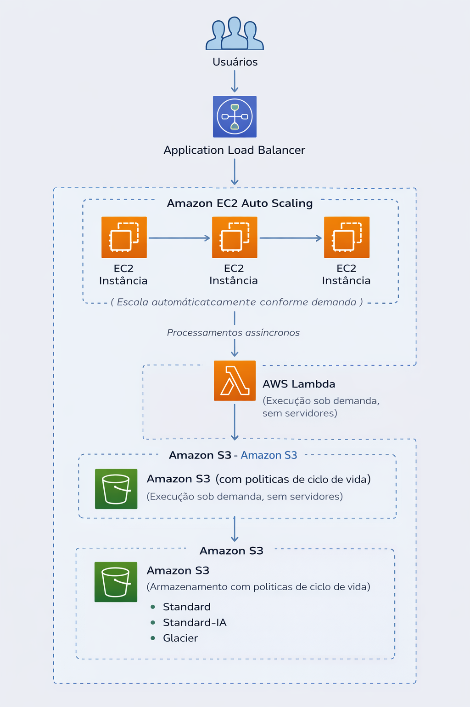

# RELATÓRIO DE IMPLEMENTAÇÃO DE SERVIÇOS AWS

Data: 10/02/2026  
Empresa: Abstergo Industries  
Responsável: Aurélio Rocha Barreto  

## Introdução

Este relatório apresenta o processo de implementação de serviços AWS na empresa Abstergo Industries, realizado por Aurélio Rocha Barreto. O objetivo do projeto foi elencar 3 serviços da AWS com a finalidade de promover redução imediata de custos operacionais, mantendo a eficiência, segurança e escalabilidade dos sistemas.

## Descrição do Projeto

O projeto de implementação de serviços foi dividido em 3 etapas, cada uma com objetivos específicos, conforme descrito a seguir:

Etapa 1:
- Nome da ferramenta: Amazon EC2 Auto Scaling
- Foco da ferramenta: Escalabilidade automática e redução de custos
- Descrição de caso de uso:
  Utilização do Amazon EC2 Auto Scaling para ajustar automaticamente a quantidade de instâncias EC2 conforme a demanda da aplicação, evitando recursos ociosos e reduzindo custos de infraestrutura.

Etapa 2:
- Nome da ferramenta: Amazon S3 (com políticas de ciclo de vida)
- Foco da ferramenta: Otimização de custos com armazenamento
- Descrição de caso de uso:
  Implementação do Amazon S3 para armazenamento de dados com políticas de ciclo de vida, movendo arquivos pouco acessados para classes de armazenamento de menor custo, como S3 Standard-IA e S3 Glacier.

Etapa 3:
- Nome da ferramenta: AWS Lambda
- Foco da ferramenta: Computação sem servidor e pagamento conforme o uso
- Descrição de caso de uso:
  Substituição de processos executados em servidores dedicados por funções AWS Lambda, permitindo pagamento apenas pelo tempo de execução e eliminando custos com servidores ativos continuamente.

## Conclusão

A implementação dos serviços AWS na empresa Abstergo Industries tem como resultado esperado a redução de custos operacionais, aumento da eficiência e melhor aproveitamento dos recursos computacionais. Recomenda-se a continuidade do uso das soluções implementadas e a avaliação constante de novas tecnologias que possam aprimorar ainda mais os processos da empresa.

## Anexos

- Documentação oficial dos serviços AWS utilizados  
EC2: https://docs.aws.amazon.com/ec2/ 
S3: https://docs.aws.amazon.com/s3/ 
Lambda: https://docs.aws.amazon.com/lambda/ 

- Diagrama da arquitetura proposta
- 

  

Assinatura do Responsável pelo Projeto:

Aurélio Rocha Barreto
